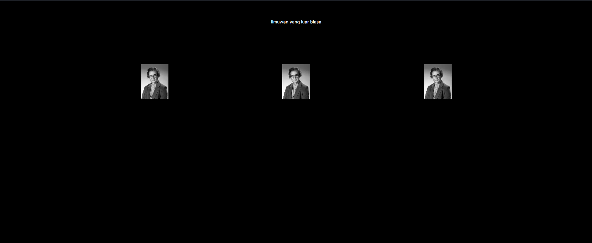
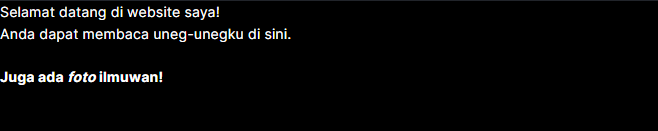
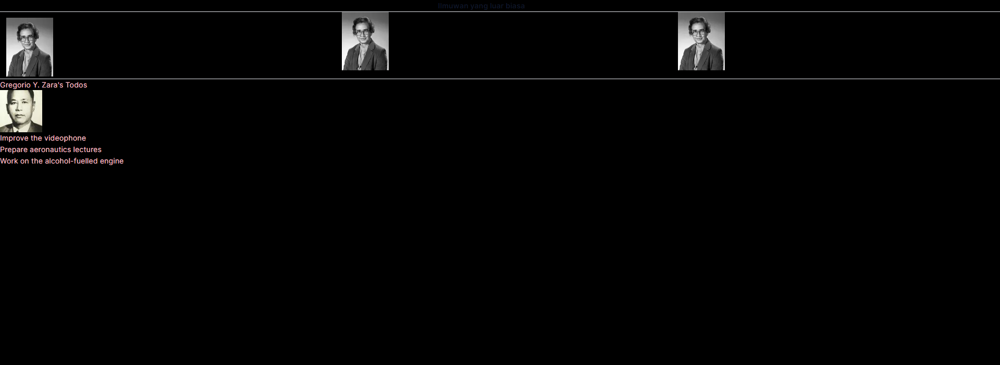
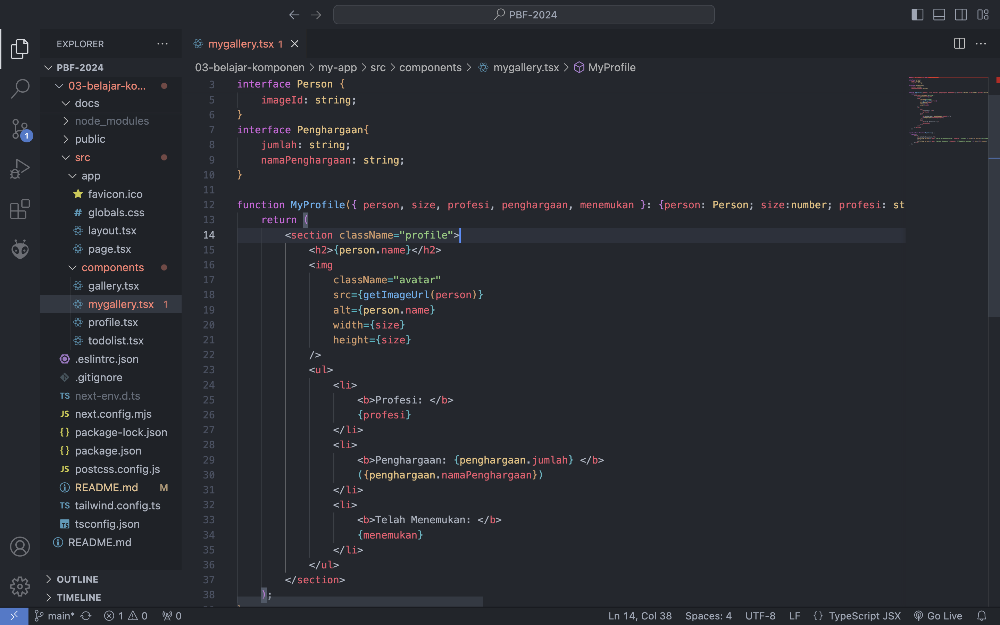
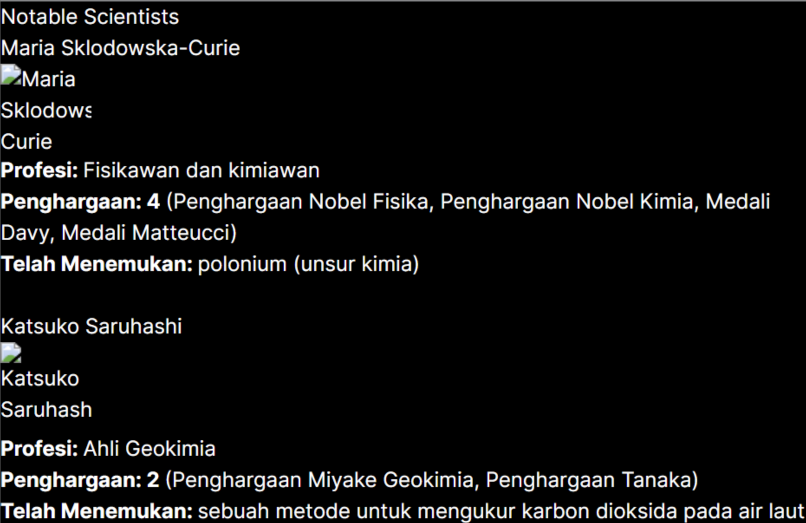
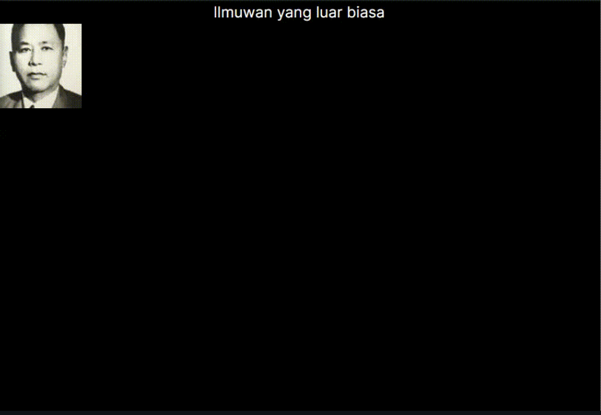
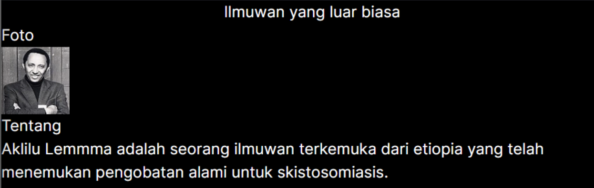

# 03 | Components, JSX, dan Props

## Praktikum 1: Mendefinisikan Komponen

### **Langkah 1: Buat Folder Baru**
Buatlah folder baru bernama `03-belajar-komponen` lalu di dalam folder tersebut, jalankan terminal dengan mengetikkan perintah berikut:

```
npx create-next-app
```
### **Langkah 2: Buat Komponen Baru**
Buatlah folder baru dan file baru di `src/components/profile.tsx` lalu ketik kode berikut ini.

```tsx
import Image from "next/image";

export default function Profile() {
    return (
      <Image
        src="https://i.imgur.com/MK3eW3Am.jpg"
        alt="Katherine Johnson"
        width={100}
        height={100}
        style={{
          maxWidth: "100%",
          height: "auto",
          margin: "13px"
        }}
      />
    );
  }
```

### **Langkah 3: Import Komponen**
Lakukan import komponen `Profile` ke `src/app/page.tsx`

```tsx
import Profile from "../components/profile";
```

>**Soal 1**
>
>Ubah isi kode `Home()` sehingga dapat tampil seperti berikut dengan memanfaatkan komponen `Profile()` yang tadi sudah dibuat dari langkah 1 tersebut!
>
>Capture hasilnya dan buatlah laporan di **README.md**. Jelaskan apa yang telah Anda pelajari dan bagaimana Anda solve error tersebut?
>
>Jangan lupa push dengan pesan commit: `"W03: Jawaban soal 1"`.

Jawab:

Mengubah code pada file `page.tsx`
```tsx
export default function Home() {
  return (
    <main className="flex flex-col items-center">
      <p className="justify-center mt-16">Ilmuwan yang luar biasa</p>

      <div className="flex mt-32">
        <Profile />
        <div className="mx-96">
          <Profile />
        </div>
        <Profile />
      </div>
    </main>
  );
}
```

Output: 


## Praktikum 2: Mengimpor dan Mengekspor Komponen

### **Langkah 1: Buat Komponen Baru**
Buatlah file baru di `src/components/gallery.tsx` berisi kode seperti berikut:
```tsx
import Profile from "./profile";

export function Gallery() {
    return (
        <div className="columns-3">
            <Profile />
            <Profile />
            <Profile />
        </div>
    );
}
```

### **Langkah 2: Impor Komponen**
Lakukan impor komponen di `src/app/page.tsx` seperti berikut ini. Hapus kode komponen lama `Profile`, lalu sesuaikan dengan komponen baru `Gallery` yang telah dibuat.
```tsx
import { Gallery } from "@/components/gallery";
```

>Soal 2
>
>Capture hasilnya dan buatlah laporan di **README.md.** Jelaskan apa yang telah Anda pelajari dan bagaimana tampilannya saat ini?
>
>Jangan lupa push dengan pesan commit: `"W03: Jawaban soal 2"`.

Jawab:

Dengan menambahkan kode pada file page.tsx
```tsx
{ <Gallery /> }
```
Kode diatas berfungsi untuk memanggil komponen Gallery

Output: 


>Soal 3
>
>Silakan perbaiki kode JSX berikut ini. Anda boleh menggunakan konverter atau perbaiki secara manual.
> 
> Capture hasilnya dan buatlah laporan di **README.md.** Jelaskan apa yang telah Anda pelajari dan mengapa error itu bisa terjadi?
>
>Jangan lupa push dengan pesan commit: `"W03: Jawaban soal 3"`.

Jawab:
Kode diatas error karena terdapat expression yang tidak satu parent elemen, dan juga penggunaan class yang harusnya menggunakan className, lalu penutup tag br yang tidak benar dan susuan tag b dan i yang belum rapih

Code:
```tsx
export default function Bio() {
  return (
    <div className="intro">
      <h1>Selamat datang di website saya!</h1>
      <p className="summary">
        Anda dapat membaca uneg-unegku di sini.
        <br /><br />
        <b>Juga ada <i>foto</i> ilmuwan!</b>
      </p>
    </div>
  );
}
```

Output:



## Praktikum 3: Menggunakan JSX dinamis

### **Langkah 1: Buat Komponen Baru**
Buatlah file baru di `src/components/todolist.tsx` berisi kode seperti berikut:
```tsx
const person = {
  name: 'Gregorio Y. Zara',
  theme: {
    backgroundColor: 'black',
    color: 'pink'
  }
};

export default function TodoList() {
  return (
    <div style={person.theme}>
      <h1>{person}'s Todos</h1>
      
      <ul>
        <li>Improve the videophone</li>
        <li>Prepare aeronautics lectures</li>
        <li>Work on the alcohol-fuelled engine</li>
      </ul>
    </div>
  );
}
```

>Soal 4
>
>Kode di atas masih terdapat error, silakan diperbaiki.
>
>Jangan lupa push dengan pesan commit: `"W03: Jawaban soal 4"`.

Jawab:

Terjadi error di kode bagian
```tsx
<h1>{person}'s Todos</h1>
```
karena penggunaan objek dan properti nya tidak lengkap.

Kode yang benar:
```tsx
<h1>{person.name}'s Todos</h1>
```


### **Langkah 2: Impor Komponen**

Lakukan impor komponen di `src/app/page.tsx` seperti berikut ini.

```tsx
import { Gallery } from "@/components/gallery";
import TodoList from "@/components/todolist";

export default function Home() {
  return (
    <section>
      <h1 className="font-semibold text-slate-900 truncate pr-20 text-center">Ilmuwan yang luar biasa</h1>
      <hr />
      <Gallery />
      <hr />
      <TodoList />
    </section>
  );
}
```

>Soal 5
>
>Buka file `src/components/todolist.tsx` lakukan ekstrak URL gambar ke dalam objek `person`.
>
>Capture hasilnya dan buatlah laporan di **README.md.** Apakah ada perbedaan pada tampilan web saat ini?
>
>Jangan lupa push dengan pesan commit: `"W03: Jawaban soal 5"`.

Jawab: 



Tidak ada perbedaan pada tampilan

>Soal6
>
>Perbaiki kode tersebut pada bagian atribut src. Kode lainnya dapat Anda sesuaikan dari jawaban soal sebelumnya. Capture hasilnya dan buatlah laporan di README.md. Jelaskan apa yang telah Anda pelajari dan bagaimana tampilannya saat ini?
>
>Jangan lupa push dengan pesan commit: `"W03: Jawaban soal 6"`

Jawab:


>tampilan saat ini tetap, tetapi pada kodingan perlu ditambahkan ` {}, $, dan `` ` agar url dapat digunakan dengan cara pemanggilan tersebut. Dengan cara pemanggilan tersebut, `saya dapat mengubah imageId dan imageSize menjadi lebih fleksibel tanpa harus mengubah link secara keseluruhan`

## Praktikum 4:  Menggunakan Props

#### Soal 7

```jsx
import { getImageUrl } from '@/utils/utils';

interface Person {
    name: string;
    imageId: string;
}
interface Penghargaan{
    jumlah: string;
    namaPenghargaan: string;
}

function MyProfile({ person, size, profesi, penghargaan, menemukan }: {person: Person; size:number; profesi: string; penghargaan: Penghargaan; menemukan: string}) {
    return (
        <section className="profile">
            <h2>{person.name}</h2>
            
            <ul>
                <li>
                    <b>Profesi: </b>
                    {profesi}
                </li>
                <li>
                    <b>Penghargaan: {penghargaan.jumlah} </b>
                    ({penghargaan.namaPenghargaan})
                </li>
                <li>
                    <b>Telah Menemukan: </b>
                    {menemukan}
                </li>
            </ul>
        </section>
    );
}

export default function MyGallery() {
    return (
        <div>
            <h1>Notable Scientists</h1>
            <MyProfile person={{ name: 'Maria Sklodowska-Curie', imageId: 'szV5sdG' }} size={70} profesi='Fisikawan dan kimiawan' penghargaan={{ jumlah: '4', namaPenghargaan: 'Penghargaan Nobel Fisika, Penghargaan Nobel Kimia, Medali Davy, Medali Matteucci' }} menemukan='polonium (unsur kimia)'/>
            <br />
            <MyProfile person={{ name: 'Katsuko Saruhashi', imageId: 'YfeOqp2Ahli Geokimia' }} size={70} profesi='Ahli Geokimia' penghargaan={{ jumlah: '2', namaPenghargaan: 'Penghargaan Miyake Geokimia, Penghargaan Tanaka' }} menemukan='sebuah metode untuk mengukur karbon dioksida pada air laut' />
        </div>
    );
}
```
Jawab: 





>(`Gambar tidak muncul dikarenakan kode pada bagian getimageurl masih belum fiks)`

#### Soal 8
>Jika kode di atas terdapat error, silakan diperbaiki.
>
>Ubahlah komponen MyAvatar untuk diolah ukuran gambarnya berdasarkan prop size. Khususnya, jika size kurang dari 90, kirimkan 's' ("small") bukan 'b' ("big") pada fungsi getImageUrl. Pastikan bahwa perubahan yang Anda buat berjalan dengan cara me-render avatars dengan nilai prop size yang berbeda dan buka gambar pada tab baru di browser.
>
>Capture hasilnya dan buatlah laporan di README.md. Jelaskan apa yang telah Anda pelajari dan bagaimana tampilannya saat ini?
>
>Jangan lupa push dengan pesan commit: "W03: 
Jawaban soal 8".

Jawab: 



> Dengan ditambahkan nya ternary operator pada bagian getImageUrl seperti ini ``` size < 90 ? 's' : 'b'``` , maka jika size kurang dari `90`, gambar akan otomatis berubah ke size 's' dan jika lebih dari 90 maka akan berubah ke size `'b'`, hal ini dapat terlihat dari perbedaan kerapatan pixel gambar pada saat size berada dibawah `90` maka gambar akan `lebih blur dan sebaliknya`. (sayangnya saya tidak bisa menunjukkan secara jelas perbedaan gambarnya karena pada saat dibuka linknya pada tab baru,`website nya merespon 404`.

#### Soal 9 

>Jika kode di atas terdapat error, silakan diperbaiki.
>
>Buatlah komponen Card dari kode di atas, lalu gunakan prop children untuk mengirimkan JSX yang berbeda.
>
>Capture hasilnya dan buatlah laporan di README.md. Jelaskan apa yang telah Anda pelajari dan bagaimana tampilannya saat ini?
>
>Jangan lupa push dengan pesan commit: "W03: Jawaban soal 9".

Jawab: 



Yang saya lakukan pada komponen Card tersebut adalah mengisi prop children dengan berbagai konten. Komponen card fleksibel terhadap isi dari konten yang di render di dalam komponen tersebut sehingga dapat dijadikan sebagai pembungkus konten lainnya.