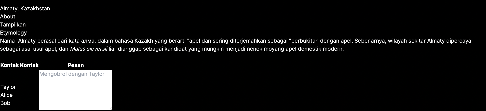

# 04 | Event dan State

## Praktikum 1: Event Handler

### **Langkah 1**
Kita mencoba membuat tombol sederhana yang belum bisa melakukan apa-apa alias belum kita buat event handler untuk tombol tersebut. Sebagai contoh, berikut adalah sebuah tombol yang belum melakukan apa pun. Kita buat folder/file baru di `src/component/button.tsx`

```tsx
export default function Tombol_1() {
    return (
        <button className="bg-blue-500 hover:bg-blue-700 text-white p-2 rounded">
            Ini tombol
        </button>
    );
}
```
Selanjutnya pada file `src/app/page.tsx` kita ubah menjadi seperti berikut

```tsx
import Tombol_1 from "@/components/button";

export default function Home() {
    return (
        <>
            <div className="container mx-auto">
                <h2>Kuis Kota</h2>
                <Tombol_1/>
            </div>
        </>
    );
}
```
Kemudian kita jalankan perintah `"npm run dev"` dan kita buka alamat `localhost:3000` pada browser. Maka akan tampil hasil seperti berikut

Output: 


### **Langkah 2**
Kita bisa menambahkan event pada tombol tersebut. Seperti contoh kita buat ketika tombol di klik, akan memunculkan notif/alert. Kita dapat membuat pesan ketika pengguna mengeklik dengan mengikuti tiga langkah berikut:<p>
    1. Deklarasikan sebuah fungsi bernama `handleClick` di dalam komponen Button kita.<p>
    2. Implementasikan logika di dalam fungsi tersebut (gunakan `alert` untuk menampilkan pesan)<p>
    3. Tambahkan handler `onClick={handleClick}` ke tag JSX `< button >`<p>

Perhatikan kode `button.tsx` berikut
```tsx
export default function Tombol_1() {
    // mnambahkan fungsi untuk menangani klik tomnol
    function handleClick() {
        alert("Tombol telah ditekan!!!");
    }

    function handleMouseOver() {
        alert("Eits, mau mencet tombol ya?");
    }

    return (
        <button
            className="bg-blue-500 hover:bg-blue-700 text-white p-2 rounded"
            onClick={handleClick}
            onMouseOver={handleMouseOver}
        >
            Ini Tombol
        </button>
    )
}
```
Jika terjadi error seperti gambar berikut


Maka kita butuh mengatur agar komponen yang kita gunakan menjadi komponen client. Untuk menjadikan komponen client, kita cukup memberikan perintah ini `"use client";` pada baris pertama file `page.tsx`
```tsx
"use client";
import Tombol_1 from "@/components/button";

export default function Home() {
```

Kita mendefinisikan fungsi `handleClick` dan kemudian mengopernya sebagai prop ke `< button >`. Method `handleClick` adalah sebuah event handler pada tombol tersebut.

Nama Method event handler sebaiknya memiliki format tertentu, seperti contoh memiliki nama yang diawali dengan kata `handle`, diikuti oleh nama event yang akan dilakukan. Contoh

- event handler untuk menangani ketika ada event klik tombol `onClick={handleClick}`,
- event handler untuk menangani ketika ada event `onMouseEnter={handleMouseEnter}`, dan lain sebagainya.

Selain itu, sebagai alternatif, Kita juga dapat mendefinisikan event handler secara inline dalam JSX secara langsung seperti berikut
```tsx
return (
        <button
            className="bg-blue-500 hover:bg-blue-700 text-white p-2 rounded"
            onClick={handleClick}
            // onMouseOver={handleMouseOver}
            onMouseLeave={() => {
                alert("Eits, mau mencet tombol ya?")
                }
            }
        >
            Ini Tombol
        </button>
    );
```
**Ingat!**

Method event handle **HARUS** dioper (ditulis nama fungsinya, tanpa tanda kurung `()`), bukan dipanggil */call* (nama fungsi ditulis dengan tanda kurung `()`). Contoh:
>Fungsi di oper **(benar)**

> ```< button onClick={handleClick} >```

> Fungsi dipanggil */call* (**salah**)

> ```< button onClick={handleClick()} >```

Perbedaannya tipis. Pada contoh pertama, fungsi `handleClick` dioper sebagai event handler `onClick`. Ini memberitahu React untuk mengingatnya dan hanya memanggil fungsi tersebut ketika pengguna mengeklik tombolnya.

Pada contoh kedua, tanda () di akhir `handleClick()` akan menjalankan fungsi tersebut langsung saat proses render, tanpa adanya klik. Ini karena JavaScript di dalam tag JSX { dan } dieksekusi secara langsung.

Silahkan *di commit untuk Praktikum 1*

Kita buat fungsi baru pada component `button.tsx`
```tsx
export function Tombol_2({isiPesan, namaTombol}) {
    return (
        <button
            className="bg-blue-500 hover:bg-blue-700 text-white p-2 rounded"
            onClick={() => alert(isiPesan)}>
            {namaTombol}
        </button>
    );
}
```

**Ingat!**

Pada component, hanya ada 1 fungsi yang memiliki `default` !

Parameter `isiPesan` dan `namaTombol` bisa diisi oleh layout yang ada di `page.tsx` nanti, sehingga komponen `Tombol_2` bernilai dinamis.

Sekarang kita modifikasi file `page.tsx` seperti berikut
```tsx
"use client";
import Tombol_1, { Tombol_2 } from "@/components/button";

export default function Home() {
    return (
        <>
          <div className="container mx-auto">
              <h2>Kuis Kota</h2>
              <Tombol_1/>
              <hr></hr>
              <Tombol_2 isiPesan="Ini Pesanku" namaTombol="Pesan" />
          </div>
        </>
    );
}
```

Coba cek di browser dan amati apa yang terjadi?


Jelaskan mengapa bisa seperti itu?

Karena kita menambahkan komponen baru pada file `button.tsx` dan parameter yang ada pada komponen baru tersebut diisi oleh layout yang ada di file `page.tsx` sehingga komponen baru tersebut bernilai dinamis

Silahkan *di commit untuk Praktikum 2*

### **Praktikum 3**
**Langkah 1 - Propagation**
Sebagai contoh coba kita modifikasi file `button.tsx` seperti berikut
```tsx
export function Tombol_2({isiPesan, namaTombol}) {
    return (
        <button
            className="bg-blue-500 hover:bg-blue-700 text-white p-2 rounded"
            onClick={() => alert(isiPesan)}>
            {namaTombol}
        </button>
    );
}

export function Tombol_3({isiPesan, namaTombol}) {
    return (
        <button
            className="bg-green-400 hover:bg-green-700 text-white p-2 rounded m-2"
            onClick={() => alert(isiPesan)}>
            {namaTombol}
        </button>
    );
}
```
Kemudian kita modifikasi fiile `page.tsx`
```tsx
"use client";
import Tombol_1, { Tombol_2, Tombol_3 } from "@/components/button";

export default function Home() {
    return (
        <>
          <div className="container mx-auto">
              <h2>Kuis Kota</h2>
              <Tombol_1/>
              <hr></hr>
              <Tombol_2 isiPesan="Ini Pesanku" namaTombol="Pesan" />
          </div>
              <br></br>
          <div className="bg-red-300" onClick={() => alert('Parent Element : Div')}>
            <Tombol_3 isiPesan="Child Element : Tombol-1" namaTombol="Tombol-1" />
            <Tombol_3 isiPesan="Child Element : Tombol-2" namaTombol="Tombol-2" />
          </div>
        </>
    );
}
```

Kemudian kita jalankan di browser, coba klik **Tombol-1**, dan amati apa yang terjadi...!!!


Kita akan disuguhkan dengan pesan/alert sebanyak 2 kali, yaitu Pesan ***"Child Element : Tombol-1"*** dan pesan ***"Parent Element : Div"***.

Hal ini terjadi karena baik untuk element **div** maupun **button** memiliki event yang sama yaitu onClick, sehingga ketika button diklik maka event handler untuk onClick pada button akan dijalankan. Kemudian baru event handler dari parent (element div) akan dijalankan.

Hal ini disebut dengan propagation, dan biasa terjadi pada elemen child dan parent yang memiliki event yang sama.
<br>
<br>
<br>
**Menghentikan Propagation**

*Event handler* menerima sebuah **objek event** sebagai satu-satunya argumen/parameter. Berdasarkan konvensi, objek tersebut biasanya ditulis **e** yang merupakan kepanjangan dari *"event"*. Anda dapat menggunakan objek ini untuk membaca informasi tentang event tersebut.

Objek event tersebut juga dapat memungkinkan untuk menghentikan propagasi. Jika kita ingin mencegah sebuah event untuk mencapai komponen induknya *(propagation)*, Kita harus memanggil e.stopPropagation() untuk mencegah propagasi.

**Langkah 2 - Stop Propagation**
```tsx
export function Tombol_3({isiPesan, namaTombol}) {
    return (
        <button
            className="bg-green-400 hover:bg-green-700 text-white p-2 rounded m-2"
            onClick={(e) => {
                    e.stopPropagation();
                    alert(isiPesan)
                }
            }>
            {namaTombol}
        </button>
    );
}
```
<br>
<br>


## **State**

### **Praktikum 4**
**Langkah 1** <p>
Kita buat file data dummy untuk mencoba state pada `src/data/article.js` yang berisi seperti berikut
```js
export const sculptureList = [{
    name: 'Homenaje a la Neurocirugía',
    artist: 'Marta Colvin Andrade',
    description: 'Although Colvin is predominantly known for abstract themes that allude to pre-Hispanic symbols, this gigantic sculpture, an homage to neurosurgery, is one of her most recognizable public art pieces.',
    url: 'https://i.imgur.com/Mx7dA2Y.jpg',
    alt: 'A bronze statue of two crossed hands delicately holding a human brain in their fingertips.'  
  }, {
    name: 'Floralis Genérica',
    artist: 'Eduardo Catalano',
    description: 'This enormous (75 ft. or 23m) silver flower is located in Buenos Aires. It is designed to move, closing its petals in the evening or when strong winds blow and opening them in the morning.',
    url: 'https://i.imgur.com/ZF6s192m.jpg',
    alt: 'A gigantic metallic flower sculpture with reflective mirror-like petals and strong stamens.'
  }, {
    name: 'Eternal Presence',
    artist: 'John Woodrow Wilson',
    description: 'Wilson was known for his preoccupation with equality, social justice, as well as the essential and spiritual qualities of humankind. This massive (7ft. or 2,13m) bronze represents what he described as "a symbolic Black presence infused with a sense of universal humanity."',
    url: 'https://i.imgur.com/aTtVpES.jpg',
    alt: 'The sculpture depicting a human head seems ever-present and solemn. It radiates calm and serenity.'
  }, {
    name: 'Moai',
    artist: 'Unknown Artist',
    description: 'Located on the Easter Island, there are 1,000 moai, or extant monumental statues, created by the early Rapa Nui people, which some believe represented deified ancestors.',
    url: 'https://i.imgur.com/RCwLEoQm.jpg',
    alt: 'Three monumental stone busts with the heads that are disproportionately large with somber faces.'
  }, {
    name: 'Blue Nana',
    artist: 'Niki de Saint Phalle',
    description: 'The Nanas are triumphant creatures, symbols of femininity and maternity. Initially, Saint Phalle used fabric and found objects for the Nanas, and later on introduced polyester to achieve a more vibrant effect.',
    url: 'https://i.imgur.com/Sd1AgUOm.jpg',
    alt: 'A large mosaic sculpture of a whimsical dancing female figure in a colorful costume emanating joy.'
  }];
```

Kemudian kita coba buat komponen baru di `src/component/gallery.tsx`
```tsx
import {sculptureList} from '@/data/article'; // ambil data yang sudah ada

export default function Gallery() {
    let index = 0;  // index data mulai dari nol

    function handleClick() {
        index = index + 1; // counter index + 1, utk melihat data selanjutnya
    }

    let sculpture = sculptureList[index]; // membacca data sesuai dengan index

    return (
        <>
            <button
                onClick={handleClick}
                className="bg-blue-500 hover:bg-blue-700 p-2 m-2 rounded"> Artikel Selanjutnya</button>
            <h2><i>{sculpture.name} </i> oleh {sculpture.artist} </h2>
            <h3>({index + 1}) dari {sculptureList.length} </h3>
            
            <p>
                {sculpture.description}
            </p>
        </>
    )
}
```
Kita panggil komponen tersebut pada `page.tsx`
```tsx
"use client";
import Tombol_1, { Tombol_2, Tombol_3 } from "@/components/button";
import Gallery from "@/components/gallery";

export default function Home() {
    return (
        <>
          <div className="container mx-auto">
              <h2>Kuis Kota</h2>
              <Tombol_1/>
              <hr></hr>
              <Tombol_2 isiPesan="Ini Pesanku" namaTombol="Pesan" />
          </div>
              <br></br>
          <div className="bg-red-300" onClick={() => alert('Parent Element : Div')}>
            <Tombol_3 isiPesan="Child Element : Tombol-1" namaTombol="Tombol-1" />
            <Tombol_3 isiPesan="Child Element : Tombol-2" namaTombol="Tombol-2" />
          </div>
              <br></br>
            <Gallery />
        </>
    );
}
```
Sekarang coba di browser dan klik tombol "Artikel Selanjutnya" dan perhatikan apa yang terjadi...!!!

Tidak terjadi apa apa

Event handler handleClick memperbarui nilai variabel index. Namun dua hal mencegah pembaruan tersebut ditampilkan ke pengguna:

1. **Variabel lokal tidak dipertahankan antar-render**. Saat React me-render komponen ini untuk kedua kalinya, react membuat ulang dari awal, sehingga index tetap bernilai 0 dan react tidak memperhatikan adanya perubahan ke variabel index tersebut.
2. **Perubahan terhadap variabel lokal tidak memicu render**. React tidak menyadari kalau dia perlu melakukan render ulang dengan data yang baru.

Untuk memperbarui komponen dengan data baru, dua hal perlu terjadi:
1. **Mempertahankan** data antar-render.
2. **Memicu** React untuk merender ulang komponennya dengan data baru.

<br>
<br>

**Menambahkan variabel *state***

**Langkah 2**

Untuk menambahkan variabel state, impor useState dari React di paling atas file `src/components/gallery.tsx`
```tsx
 import { useState } from 'react';
```
Lalu, ubah baris berikut:

`let index = 0;`

menjadi

`const [index, setIndex] = useState(0);`

index merupakan variabel state dan setIndex adalah fungsi setter.

Ubah fungsi dalam handleClick menjadi seperti ini

`function handleClick() {
setIndex(index + 1); // counter index + 1, utk melihat data selanjutnya
}`

Maka kode pada gallery.tsx seperti berikut
```tsx
import {sculptureList} from '@/data/article'; // ambil data yang sudah ada
import { useState } from 'react';

export default function Gallery() {
    // let index = 0;  // index data mulai dari nol
    const [index, setIndex] = useState(0);

    function handleClick() {
        // index = index + 1; // counter index + 1, utk melihat data selanjutnya
        setIndex(index + 1); // counter index + 1, utk melihat data selanjutnya
    }

    let sculpture = sculptureList[index]; // membacca data sesuai dengan index

    return (
        <>
            <button
                onClick={handleClick}
                className="bg-blue-500 hover:bg-blue-700 p-2 m-2 rounded"> Artikel Selanjutnya</button>
            <h2><i>{sculpture.name} </i> oleh {sculpture.artist} </h2>
            <h3>({index + 1}) dari {sculptureList.length} </h3>
            
            <p>
                {sculpture.description}
            </p>
        </>
    )
}
```
Jalankan pada browser dan amati apa yang terjadi.

Ketika `button` artikel selanjutnya di klik, maka artikel yang ditampilkan akan berganti

Silahkan *di commit untuk Praktikum 4*

**Mengelola State**
### **Praktikum 5**

**Langkah 1**
Kita buat komponen baru `src/components/form.tsx`
```tsx
import { useState } from "react";

export default function Form(){
    const [jawaban, setJawaban] = useState('');
    const [error, setError] = useState(null);
    const [status, setStatus] = useState('typing');

    if (status == 'success') {
        return <h1>Yay... Jawaban Benar|</h1>
    }

    async function handleSubmit(e: { preventDefault: () => void; }) {
        e.preventDefault();
        setStatus('submitting');
        try {
            await submitForm(jawaban);
            setStatus ('success');
        } catch (err) {
            setStatus('typing');
            setError(err);
        }
    }

    function handleTextareaChange(e) {
        setJawaban(e.target.value);
    }

    return (
        <>
            <div className="w-full max-w-xs">
                <h2>Tebak Nama Hewan</h2>
                <p>Hewan apa yang ditakuti oleh doraemon?</p>
                <form
                    className="shadow-md rounded px-8 pt-6 pb-8 mb-4 text-black border-gray-400"
                    onSubmit={handleSubmit}>
                    <textarea
                        value={jawaban}
                        onChange={handleTextareaChange}
                        disabled={status === 'submitting'}
                    />
                    <br />
                    <button
                        className="bg-blue-400 p-2 m-2 rounded text-sm text-white"
                        disabled={jawaban.length === 0 || status === 'submitting'}>
                        Submit
                    </button>
                    {error !== null && <p className="Error text-red-500 text-sm">{error.message}</p>}
                </form>
            </div>
        </>
    );
}

function submitForm(jawaban) {
    // Anggap kode ini melakukan *request*
    return new Promise<void>((resolve, reject) => {
        setTimeout (() => {
            let shouldError = jawaban.toLowerCase() |== 'tikus'
            if (shouldError) {
                reject (new Error ('Tebakan yang bagus tetapi jawaban salah. Silahkan coba lagi!'));
            } else {
                resolve();
            }
        }, 500); // set timeout selama 0,5 detik
    }) ;
}
```
Kemudian kita tambahkan kode pada file `page.tsx`
```tsx
"use client";
import Tombol_1, { Tombol_2, Tombol_3 } from "@/components/button";
import Form from "@/components/form";
import Gallery from "@/components/gallery";

export default function Home() {
    return (
        <>
          <div className="container mx-auto">
              <h2>Kuis Kota</h2>
              <Tombol_1/>
              <hr></hr>
              <Tombol_2 isiPesan="Ini Pesanku" namaTombol="Pesan" />
          </div>
              <br></br>
          <div className="bg-red-300" onClick={() => alert('Parent Element : Div')}>
            <Tombol_3 isiPesan="Child Element : Tombol-1" namaTombol="Tombol-1" />
            <Tombol_3 isiPesan="Child Element : Tombol-2" namaTombol="Tombol-2" />
          </div>
              <br></br>
            <Gallery />
            Jalankan pada browser, amati dan laporkan apa yang terjadi..!!  <br></br>
            <Form />
        </>
    );
}
```
Jalankan pada browser, amati dan laporkan apa yang terjadi..!!


Akan muncil sebuah box form seperti gambar diatas yang bisa kita submit text untuk mendapat respon dari form tersebut

Jika jawaban benar maka akan menampilkan text seperti dibawah


Dan jika salah makan menampilkan text


<br>

**Memilih struktur state**<p>
Mengatur struktur state dengan baik dapat membuat perbedaan antara komponen yang mudah dimodifikasi dan di-*debug*, dan komponen yang selalu menjadi sumber *error*. Perlu dicatat bahwa ***state***

**tidak boleh** mengandung informasi yang tidak perlu atau duplikat. Karena jika ada *state* yang tidak perlu, mudah untuk lupa memperbarui *state* tersebut, yang akhirnya memperkenalkan masalah baru!

Misalnya, formulir ini memiliki variabel state fullName yang **redundan**:

<br>

**Langkah 2**

Kita tambahkan kode berikut pada `src/component/form.tsx`
```tsx
export function Form_2() {
    const [firstName, setFirstName] = useState('');
    const [lastName, setLastName] = useState('');
    const [fullName, setFullName] = useState('');

    function handleFirstNameChange(e) {
        setFirstName(e.target.value);
        setFullName(e.target.value + ' ' + lastName);
    }

    function handleLastNameChange(e) {
        setLastName(e.target.value);
        setFullName(firstName + ' ' + e.target.value);
    }

    return (
        <>
            <h2>Silahkan isi nama lengkap anda</h2>
            <label className="block w-full m-2">
                Nama depan
                <input className="text-sm text-black ml-2 rounded"
                    value={firstName}
                    onChange={handleFirstNameChange}
                />
            </label>

            <label className="block w-full m-2">
                Nama belakang:
                <input className="text-sm text-black ml-2 rounded"
                    value={lastName}
                    onChange={handleLastNameChange}
                />
            </label>
            <p>Nama lengkap Anda adalah : <b className=" text-blue-600">(fullName)</b></p>
        </>
    );
}
```
Kemudian tambahkan ke `page.tsx`
```tsx
    <br></br>
<Form_2 />
    </>
```
Jalankan pada browser dan amati...!!!


Kita tahu bahwa state fullName hanya merupakan gabungan string dari state firstName dan lastName. Hal ini membuat state redundan, dan bisa membuat kesalahan/bug pada aplikasi react/nextjs. Untuk itu, state fullName bisa dihapus dan digantikan variable biasa.

Coba perhatikan dan implementasikan kode berikut pada `src/component/form.tsx`
```tsx
export function Form_2() {
    const [firstName, setFirstName] = useState('');
    const [lastName, setLastName] = useState('');

    const fullName = firstName + ' ' + lastName;

    function handleFirstNameChange(e) {
        setFirstName(e.target.value);
    }

    function handleLastNameChange(e) {
        setLastName(e.target.value);
    }
```
Jalankan pada browser dan amati apa yang terjadi.


**Soal**

1. **Apa perbedaan dari fungsi Form_2 yang pertama dengan yang kedua?**

>Fungsi pertama yaitu handleFirstName() berfungsi untuk memperbarui state fullName pada bagian firstName dengan mengambil value yang diinputkan, ditambah dengan state lastName saat ini. Sedangkan handleLastName() berfungsi sebaliknya yaitu utnuk memperbarui bagian lastName pada state fullName, dengan menambahkan state fisrtName saat ini dengan value yang diinputkan.

2. **Kenapa perlu menghapus state fullName? Apa keuntungannya?**

>Karena fullName cukup diinisialisasi diawal kalau merupakan hasil dari firstName ditambah lastName, sehingga tidak perlu melewati function handle dari firstName maupun lastName untuk mengset ulang fullName ketika akan ada perubahan, sehingga hal ini akan mengurangi aksi yang dilakukan, jika sebelumnya setiap fucntion memiliki aksi untuk melakukan perbaruan ke fullName, maka sekarang cukup menginisialisasi variabel fullName di awal saja. Meskipun begitu, hasil yann ditampilkan tetap sama dengan sebelumnya.


### **Praktikum 6**

**Langkah 1** 

Kita buat file komponen pada `src/components/accordion.tsx`


Lalu kita tambahkan component Accordion ke file `page.tsx`

```tsx
"use client";
import Accordion from "@/component/accordion";
import Tombol_1, { Tombol_2, Tombol_3 } from "@/component/button";
import Messenger, { Chat } from "@/component/chat";
import Form, { Form_2 } from "@/component/form";
import Gallery from "@/component/gallery";


export default function Home() {
  return (
    <>
      <div className="container mx-auto">
        <h2>Kuis Kota</h2>
        <Tombol_1 />
        <hr></hr>
        <Tombol_2 isiPesan="Ini Pesanku" namaTombol="Pesan" />
      </div>
      <br></br>
      <div className="bg-red-300" onClick={() => alert('Parent Element : Div')}>
        <Tombol_3 isiPesan="Child Element : Tombol-1" namaTombol="Tombol-1" /> 
        <Tombol_3 isiPesan="Child Element : Tombol-2" namaTombol="Tombol-2" /> 
      </div>
      <br></br>
      <Gallery />
      <br></br>
      <Form />
      <br></br>
      <Form_2 />
      <br></br>
      <Accordion />
      <br></br>
      <Messenger />
    </>
  );
}
```

**Amati dan laporkan apa yang terjadi?**

>Setiap panel ditampilkan secara bergantian, tergantung panel mana yang diklik "Tampilkan". Hal tersebut dapat terjadi dengan mengecek kondisi antara activeIndex saat ini dengan value dari setiap panel, jika panel memiliki activeIndex dan value yang sesuai maka teks akan ditampilkan. Saat button "Tampilkan" diklik maka activeIndex saat ini juga akan ikut berubah.

**Langkah 2**



>Perbedaan yang cukup jelas terlihat adalah dimana saat tidak menggunakan key, input yang dimasukkan ditext area akan tetap terbawa atau ada walaupun sudah berpindah kontak, sedangkan ketika menggunakan key, input tersebut akan hilang jika berpindah kontak.


**Soal**

1. Apa tujuan dari penulisan ini key={to.email} pada < Chat key={to.email} contact={to} / > ?

Props tersebut ditunjukkan untuk memberikan identitas unik untuk setiap komponen, sehingga tidak akan dianggap sebagai komponen yang sama.

2. Apa fungsi dari props key tersebut?

Dengan menggunakan props key tersebut, maka suatu aksi akan berpengaruh ke komponen dengan key yang sesuai saja, tidak diterapkan ke semua komponen walaupun struktur nya sama, contohnya seperti pada praktikum 6 ini. Input yang dimasukkan ditext area akan tetap terbawa atau ada walaupun sudah berpindah kontak, sedangkan ketika menggunakan key, input tersebut akan hilang jika berpindah kontak.
