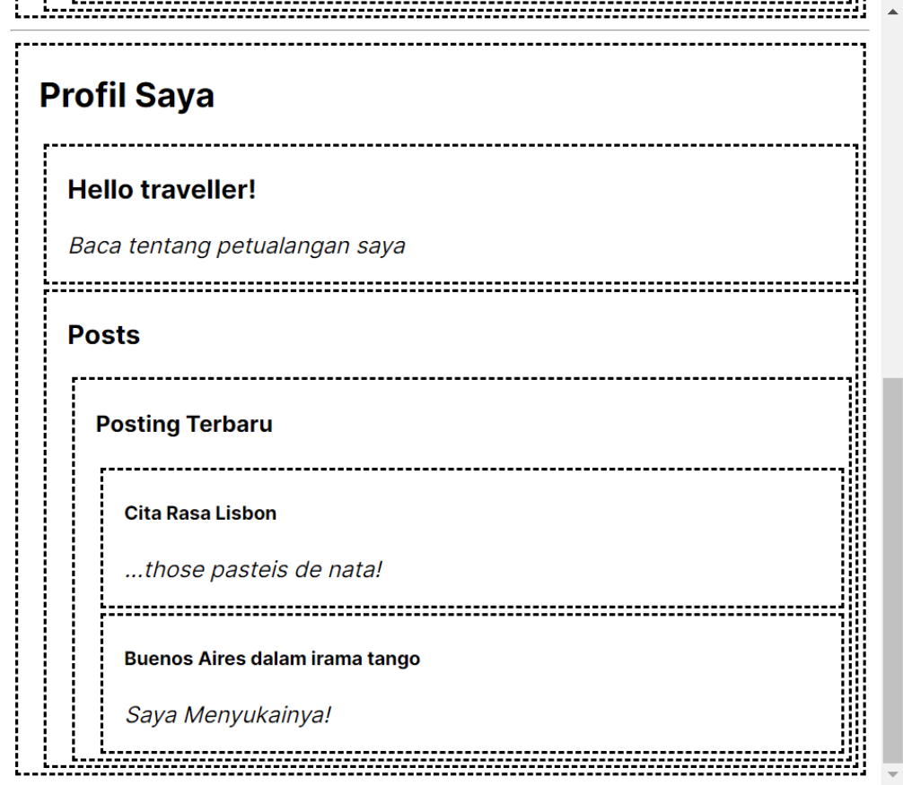

# 07 | Belajar Context NextJS

# Praktikum 1:  Membuat Variasi Ukuran Teks Heading dengan Context

#### Langkah 1: Buat project baru dan repo baru di GitHub
> Silakan buat project baru seperti berikut dan repo baru dengan nama `#07-belajar-context-nextjs`


#### Langkah 2:  Buat struktur folder dengan prinsip `atomic design`

#### Langkah 3: Buat komponen atom baru
>Buat file baru di `src/components/atoms/heading.tsx` berisi kode sebagai berikut.

```tsx
 export default function Heading({ level, children }: { level: number; children: any }) {
    switch (level) {
        case 1:
            return <h1>{children}</h1>;
        case 2:
            return <h2>{children}</h2>;
        case 3:
            return <h3>{children}</h3>;
        case 4:
            return <h4>{children}</h4>;
        case 5:
            return <h5>{children}</h5>;
        case 6:
            return <h6>{children}</h6>;
        default:
            throw Error('Unknown level: ' + level);
    }
}
```

> Kemudian buat file baru di `src\components\atoms\section.tsx` berisi kode berikut.

```tsx
export default function Section({ children }: { children: any }) {
    return (
        <section className="section">
            {children}
        </section>
    );
}
```

>Lalu bagian MainPage buat file baru di `src\components\templates\main_page.tsx` berisi kode sebagai berikut.

``` tsx
import Heading from "../atoms/heading";
import Section from "../atoms/section";

export default function MainPage() {
    return (
        <Section>
            <Heading level={1}>Title</Heading>
            <Section>
                <Heading level={2}>Heading</Heading>
                <Heading level={2}>Heading</Heading>
                <Heading level={2}>Heading</Heading>
                <Section>
                    <Heading level={3}>Sub-heading</Heading>
                    <Heading level={3}>Sub-heading</Heading>
                    <Heading level={3}>Sub-heading</Heading>
                    <Section>
                        <Heading level={4}>Sub-sub-heading</Heading>
                        <Heading level={4}>Sub-sub-heading</Heading>
                        <Heading level={4}>Sub-sub-heading</Heading>
                    </Section>
                </Section>
            </Section>
        </Section>
    );
}
```

#### Langkah 4:  Ubah isi kode `page.tsx` dan `run`
> Ubahlah kode di`src\app\page.tsx` seperti berikut. Lalu `run` dan lihat hasilnya di browser Anda.

### Soal 1: 
> Capture hasilnya dan buatlah laporan di `README.md.` Jelaskan apa yang telah Anda pelajari dan bagaimana tampilannya saat ini?

> Jangan lupa push dengan pesan commit: `"W07: Jawaban soal 1".`


> Pada kode diatas komponen templates `main_page` memanggil komponen heading dengan level heading yang berbeda beda, section pada komponen atoms digunakan untuk membungkus komponen heading

#### Langkah 5.1: Buat Context

> Pertama, Anda perlu membuat context. Anda harus mengekspornya dari sebuah file sehingga komponen Anda dapat menggunakannya. Buatlah file baru di `src\utilities\context\mycontext.tsx` yang berisi kode sebagai berikut:
``` tsx
import { createContext } from "react";

export const LevelContext = createContext(1);
```

#### Langkah 5.2: Gunakan context

> Ubahlah isi kode komponen Heading dengan Impor useContext Hook dari `React` dan `context Anda`:

#### Langkah 5.3: Sediakan context

### Soal 2: 
> Capture hasilnya dan buatlah laporan di `README.md`. Jelaskan apa yang telah Anda pelajari dan bagaimana tampilannya saat ini?

>Jika terjadi error, silakan perbaiki, Mengapa hal itu bisa terjadi? Jelaskan!

>Jangan lupa push dengan pesan commit: `W07: Jawaban soal 2".`


>Error terjadi karena react membutuhkan `"use client"`


> Level context yang pada sebelumnya harus di tempatkan di `heading 1 per 1,` sekarang dapat ditempatkan pada Section menggunakan LevelContext sehingga Heading membaca` LevelContext`dari `Section parent`

#### Langkah 6: Menggunakan dan menyediakan context dari komponen yang sama

### Soal 3:

>Capture hasilnya dan buatlah laporan di`README.md.` Jelaskan apa yang telah Anda pelajari dan bagaimana tampilannya saat ini?

> Jangan lupa push dengan pesan commit: `"W07: Jawaban soal 3".`

> Untuk tampilan sama seperti sebelumnya, tetapi dalam penerapan nya menjadi lebih simple karena LevelContext otomatis mendeteksi level dari parent nya, sehingga jika ada Section di dalam Section, otomatis Level parent bertambah 1 dari level sebelumnya

# Praktikum 2:  Membuat Context melewati komponen perantara

#### Langkah 1: Buat komponen atom baru
> Buatlah file baru di `src\components\atoms\section2.tsx` berisi kode sebagai berikut.

``` tsx
import { LevelContext } from "@/utilities/context/mycontext";
import { useContext } from "react";

export default function Section2({children, isFancy}: {children: any, isFancy: boolean}){
    const level = useContext(LevelContext);
    return(
        <section className={'section' + (isFancy?'Fancy':'')}>
            <LevelContext.Provider value={level+1}>
                {children}
            </LevelContext.Provider>
        </section>
    )
}
```

#### Langkah 1.2: Lalu buatlah file baru di `src\components\atoms\post.tsx` dengan kode berikut.
``` tsx 
import Heading from "./heading";
import Section2 from "./section2";

export default function Post({title, body}: {title: string, body: string}){
    return(
        <Section2 isFancy={true}>
            <Heading>
                {title}
            </Heading>
            <p><i>{body}</i></p>
        </Section2>
    )
}
```

#### Langkah 1.3: Selanjutnya kita buat molecules di `src\components\molecules\recentpost.tsx` dengan kode berikut.

``` tsx
import Heading from "../atoms/heading";
import Post from "../atoms/post";
import Section2 from "../atoms/section2";

export default function RecentPosts() {
    return(
        <Section2 isFancy= {true}>
            <Heading>Posting Terbaru</Heading>
            <Post title="Maulidio Farhan Rizkullah" body="2141720041"/>
            <Post title="Cita Rasa Lisbon" body="...those pasteis de nata!"/>
            <Post title="Buenos Aires dalam irama tango" body="Saya Menyukainya!"/>
        </Section2>
    )
}
```

#### Langkah 1.4: Kemudian buat organisms di `src\components\organisms\allpost.tsx` dengan kode berikut.

``` tsx
import Heading from "../atoms/heading";
import Section2 from "../atoms/section2";
import RecentPosts from "../molecules/recentpost";

export default function AllPosts(){
    return(
        <Section2 isFancy={true}>
            <Heading>Posts</Heading>
            <RecentPosts/>
        </Section2>
    )
}
```
 
#### Langkah 1.5: Terakhir kita buat templates di `src\components\templates\profile_page.tsx` dengan kode berikut.
``` tsx
import Heading from "../atoms/heading";
import Post from "../atoms/post";
import Section2 from "../atoms/section2";
import AllPosts from "../organisms/allpost";

export default function ProfilePage(){
    return(
        <Section2 isFancy={true}>
            <Heading>Profil Saya</Heading>
            <Post title="Hello traveller!" body="Baca tentang petualangan saya"/>
            <AllPosts/>
        </Section2>
    )
}
```

#### Langkah 2: Tambahkan `ProfilePage` ke `page.tsx` lalu run

``` tsx
"use client";

import MainPage from "@/components/templates/main_page";
import ProfilePage from "@/components/templates/profile_page";

export default function home() {
  return (
    <>
      <MainPage />
      <hr />
      <ProfilePage />
      </>
  );
}
```
#### Langkah 2.1: Hapus bagian theme pada file `tailwind.config.ts` seperti kode berikut.

``` tsx
import type { Config } from "tailwindcss";

const config: Config = {
  content: [
    "./src/pages/**/*.{js,ts,jsx,tsx,mdx}",
    "./src/components/**/*.{js,ts,jsx,tsx,mdx}",
    "./src/app/**/*.{js,ts,jsx,tsx,mdx}",
  ],
  theme: {
    },
  plugins: [],
};
export default config;
```

#### Langkah 2.2: Hapus semua style CSS di file `src\app\globals.css` lalu ganti dengan kode berikut.

``` tsx
section {
  border-color: black;
  border-width: 2px;
  padding-left: 15px;
  margin: 3px;
  border-style: dashed;
}
```

#### Hasil: Ketika Anda run dengan `npm run dev` maka di browser akan tampil seperti berikut.

### Soal 4

> Capture hasilnya dan buatlah laporan di `README.md.` Tambahkan teks Nama dan NIM pada bagian komponen Post agar menunjukkan itu hasil kerja Anda!

> Jangan lupa push dengan pesan commit:`"W07: Jawaban soal 4".`


