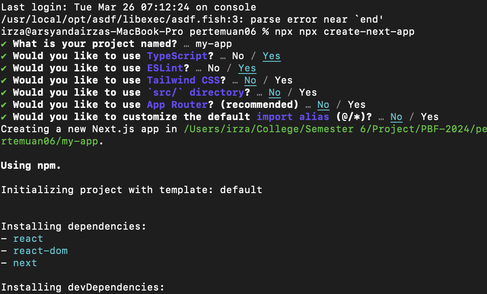
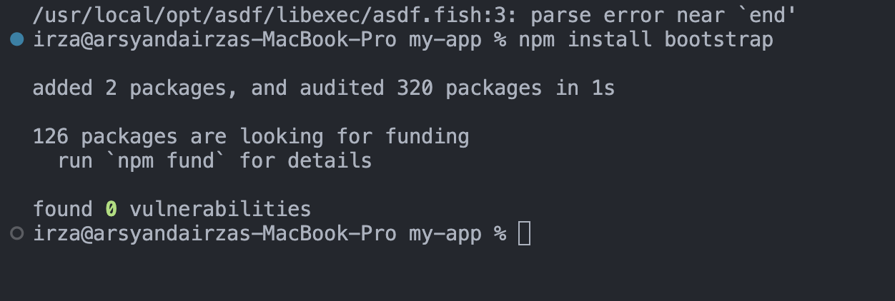
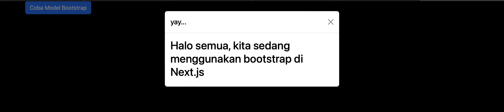
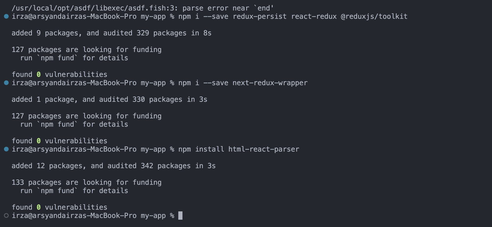
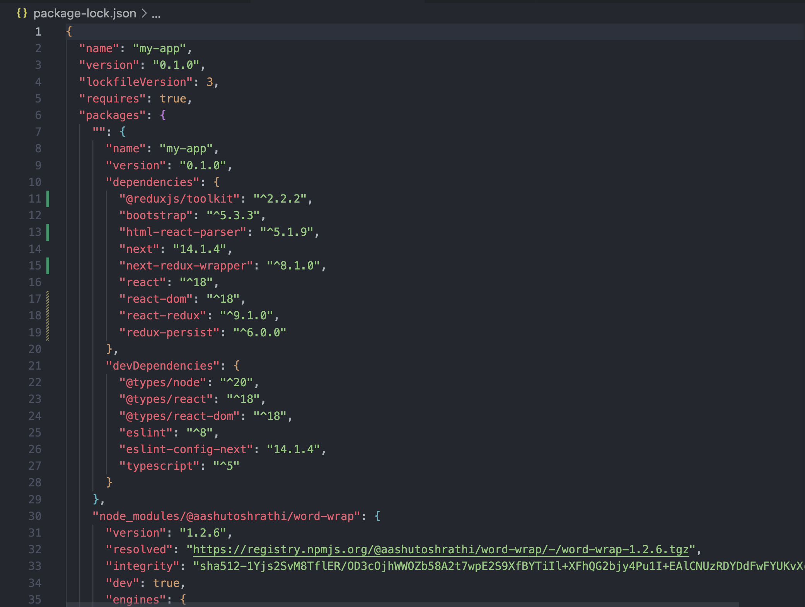
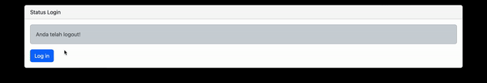
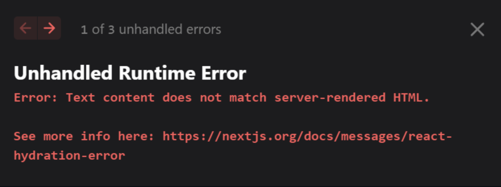
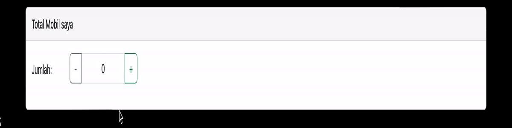

# 06 |  React Redux

## Praktikum 1: Instalasi Redux dan bootstrap

#### Langkah 1: **INFO**
>Kita install project `next.js baru`, karena kita tidak menggunakan default App Router. Kita buat project baru dengan nama pertemuan-06 pada repo PBF kita.



#### Langkah 3 
>Kali ini kita coba pakai CSS Library Bootstrap dengan menjalankan perintah
```
npm install bootstrap
```


#### Langkah 4
>Kemudian kita import bootstrap pada aplikasi `next.js` kita. Kita edit file`pages/_app.tsx`
``` tsx
import "bootstrap/dist/css/bootstrap.min.css";
import "@/styles/globals.css";
import type { AppProps } from "next/app";
import { useEffect } from "react";

function MyApp({Component, pageProps}:any) {
  useEffect(()=>{
    require("bootstrap/dist/js/bootstrap.bundle.min.js");
  },[]);

  return <Component {...pageProps} />;
}

export default MyApp;
```

#### Langkah 5
>Sekarang kita perlu mencoba implementasi bootstrap pada project `next.js` kita. Contoh kita edit file pages/`index.tsx` menjadi seperti ini
``` tsx
export default function Home() {
  return (      
    <div className="container">
      <div className="row">
        <div className="col-12">
          <button type="button"
                  className="btn btn-primary"
                  data-bs-toggle="modal"
                  data-bs-target="#exampleModal">
                  Coba Model Bootstrap
          </button>
        </div>
      </div>
      <div  className="modal fade"
            id="exampleModal"
            tabIndex=[1]
            aria-labelledby="exampleModalLabel"
            aria-hidden="true">
        <div className="modal-dialog">
          <div className="modal-content">
            <div className="modal-header">
              <h5 className="modal-title text-black" id="exampleModalLabel"> yay... </h5>
              <button
                type="button"
                className="btn-close"
                data-bs-dismiss="modal"
                aria-label="Close"></button>
            </div>
            <div className="modal-body text-black">
              <h2>Halo semua, kita sedang menggunakan bootstrap di Next.js</h2>
            </div>
          </div>
        </div>
      </div>
    </div>
  );
}
```

## Hasil



## Praktikum 2: Contoh Login dengan Redux

#### Langkah 1
>Komponen yang digunakan pada praktikum kali ini adalah redux-toolkit dan redux-persistent sehingga kita perlu menginstall-nya

```
npm i --save redux-persist react-redux @reduxjs/toolkit
```

>Selanjutnya kita install wrapper untuk redux di `next.js`

```
npm i --save next-redux-wrapper
```

>Selain itu, kita akan menggunakan html parser yang ada di `react`. Hal ini kita gunakan untuk memparsing html string menjadi sebuah html page

```
npm install html-react-parser
```



#### Langkah 2: 

>Setelah berhasil menginstal kita cek di file `package.json` apakah library sudah ada



#### Langkah 3:

``` tsx
import {createSlice} from '@reduxjs/toolkit';

export const initialState = {
    isLogin: false,
}

const authSlice = createSlice({
    name: 'auth',
    initialState,
    reducers:{
        setLogin(state, action){
            if(action && action.payload && typeof action.payload.isLogin !== 'undefined'){
                state.isLogin = action.payload.isLogin;
            }
        }
    }
});

export const {setLogin} = authSlice.actions;

const authReducer = authSlice.reducer;
export default authReducer;
```

#### Langkah 4:
>Selanjutnya kita buat file `redux/store/store.js` seperti berikut

``` tsx
import { combineReducers, configureStore } from '@reduxjs/toolkit';
import authReducer from '../auth/authSlice';
import storage from 'redux-persist/lib/storage';
import { persistStore, persistReducer, FLUSH, REHYDRATE, PAUSE, PERSIST, PURGE, REGISTER } from 'redux-persist';


const persistConfig = {
    key: process.env.NEXT_PUBLIC_FINGERPRINT_NAME,  
    storage,
    whitelist: ['auth'],
};

const rootReducer = combineReducers({
    auth:authReducer,
})

const persistedReducer = persistReducer(persistConfig, rootReducer);
const store = configureStore({
    reducer: persistedReducer,
    middleware: (getDefaultMiddleware) =>
        getDefaultMiddleware({
            serializableCheck: {
                ignoredActions: [FLUSH, REHYDRATE, PAUSE, PERSIST, PURGE, REGISTER],
            },
        }),
});

const persistor = persistStore(store);
export { store, persistor };
```
#### Soal 1:
>Coba akses `http://localhost:3000/login,` dan klik tombol login. Kemudian lakukan refresh page berkali-kali `(jika perlu restart npm run dev nya)`. Simpulkan apa yang terjadi ?



#### Soal 2:
>Baris 25 dan 30 terdapat method `parse()`, apa yang terjadi jika kita tidak menggunakan method tersebut?



>react tidak dapat mengkonversi string HTML menjadi elemen React secara otomatis. Sebagai gantinya,akan mengirimkan `string HTML mentah ke JSX`, yang tidak akan dikenali oleh React sebagai elemen React yang valid, sehingga akan muncul error tersebut.


## Praktikum 3: Membuat Aplikasi Counter Sederhana

#### Langkah 1:
>Kita buat file di `redux/counter/naikTurunSlice.js`

``` tsx
const { createSlice } = require("@reduxjs/toolkit");

export const naikTurunSlice = createSlice({
    name: 'CounterNaikTurun',
    initialState:{
        totalCounter: 0
    },
    reducers:{
        tambahCounter(state){
            state.totalCounter += 1;
        },
        kurangCounter(state){
            state.totalCounter -= 1;
        }
    },
})

export const {tambahCounter, kurangCounter} = naikTurunSlice.actions;
export default naikTurunSlice.reducer;
```

#### Langkah 2:
>Setelah itu kita modifikasi `redux/store/store.js` untuk menambahkan Redux reducer pada store

``` tsx
import { combineReducers, configureStore } from '@reduxjs/toolkit';
import authReducer from '../auth/authSlice';
import storage from 'redux-persist/lib/storage';
import { persistStore, persistReducer, FLUSH, REHYDRATE, PAUSE, PERSIST, PURGE, REGISTER } from 'redux-persist';
import counterReducer from '../counter/naikTurunSlice';

const persistConfig = {
    key: process.env.NEXT_PUBLIC_FINGERPRINT_NAME,  
    storage,
    whitelist: ['auth'],
};

const rootReducer = combineReducers({
    auth:authReducer,
    counter: counterReducer,
})

const persistedReducer = persistReducer(persistConfig, rootReducer);
const store = configureStore({
    reducer: persistedReducer,
    middleware: (getDefaultMiddleware) =>
        getDefaultMiddleware({
            serializableCheck: {
                ignoredActions: [FLUSH, REHYDRATE, PAUSE, PERSIST, PURGE, REGISTER],
            },
        }),
});

const persistor = persistStore(store);
export { store, persistor };
```

### Langkah 3:
>Kita buat file baru di `pages/counter.tsx`

``` tsx
import { tambahCounter, kurangCounter } from "@/redux/counter/naikTurunSlice";
import { useDispatch, useSelector } from "react-redux";

export default function CounterNaikTurun(){
    const {totalCounter} = useSelector((state)=> state.counter);

    const dispatch = useDispatch();

    function tombolTambah(){
        dispatch(tambahCounter())
    }

    function tombolKurang(){
        if(totalCounter > 0){
            dispatch(kurangCounter())
        } else{
            alert('Minimal 0')
        }
    }
    return(
        <div className="container">
            <div className="row">
                <div className="col-12">
                    <div className="card mt-3">
                        <div className="card-header"> Total Mobil saya</div>
                        <div className="card-body">
                            <div className="row">
                                <div className="col-1 mt-2">Jumlah: </div>
                                <div className="col-2">
                                    <div className="input-group mb-3">
                                        <button className="btn btn-outline-secondary" onClick={()=> tombolKurang()}>
                                            -
                                        </button>
                                        <span className="form-control text-center">{totalCounter}</span>
                                        <button className="btn btn-outline-success" onClick={()=> tombolTambah()}>
                                            +
                                        </button>
                                    </div>
                                </div>
                            </div>
                        </div>
                    </div>
                </div>
            </div>
        </div>
    )
}
```

## Hasil: 

>Kemudian kita jalankan di browser dengan url `localhost:3000/counter,`dan amati apa yang terjadi?


